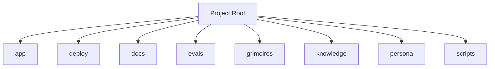

<!-- AGENT-CONTEXT
name: loa-dixie
type: framework
purpose: **Dixie is a governed multi-agent BFF (Backend-for-Frontend) for the HoneyJar
key_files: [CLAUDE.md, .claude/loa/CLAUDE.loa.md, .loa.config.yaml, .claude/scripts/, .claude/skills/]
interfaces:
  core: [/auditing-security, /autonomous-agent, /bridgebuilder-review, /browsing-constructs, /bug-triaging]
dependencies: [git, jq, yq]
ecosystem:
  - repo: 0xHoneyJar/loa-finn
    role: runtime
    interface: hounfour-router
    protocol: loa-hounfour@8.3.1
  - repo: 0xHoneyJar/loa-hounfour
    role: protocol
    interface: npm-package
    protocol: loa-hounfour@8.3.1
  - repo: 0xHoneyJar/arrakis
    role: distribution
    interface: jwt-auth
    protocol: loa-hounfour@8.3.1
capability_requirements:
  - filesystem: read
  - filesystem: write (scope: state)
  - filesystem: write (scope: app)
  - git: read_write
  - shell: execute
  - github_api: read_write (scope: external)
version: v2.0.0
installation_mode: unknown
trust_level: L2-verified
-->

# loa-dixie

<!-- provenance: DERIVED -->
**Dixie is a governed multi-agent BFF (Backend-for-Frontend) for the HoneyJar

The framework provides 29 specialized skills, built with TypeScript/JavaScript, Python, Shell.

## Key Capabilities
<!-- provenance: DERIVED -->
The project exposes 15 key entry points across its public API surface.

### .claude/adapters

- **_build_provider_config** — Build ProviderConfig from merged hounfour config. (`.claude/adapters/cheval.py:152`)
- **_check_feature_flags** — Check feature flags. (`.claude/adapters/cheval.py:192`)
- **_error_json** — Format error as JSON for stderr (SDD §4.2.2 Error Taxonomy). (`.claude/adapters/cheval.py:77`)
- **_load_persona** — Load persona.md for the given agent with optional system merge (SDD §4.3.2). (`.claude/adapters/cheval.py:96`)
- **cmd_cancel** — Cancel a Deep Research interaction. (`.claude/adapters/cheval.py:511`)
- **cmd_invoke** — Main invocation: resolve agent → call provider → return response. (`.claude/adapters/cheval.py:211`)
- **cmd_poll** — Poll a Deep Research interaction. (`.claude/adapters/cheval.py:467`)
- **cmd_print_config** — Print effective merged config with source annotations. (`.claude/adapters/cheval.py:442`)
- **cmd_validate_bindings** — Validate all agent bindings. (`.claude/adapters/cheval.py:453`)
- **main** — CLI entry point. (`.claude/adapters/cheval.py:547`)

### .claude/adapters/loa_cheval/config

- **LazyValue** — Deferred interpolation token. (`.claude/adapters/loa_cheval/config/interpolation.py:41`)
- **_check_env_allowed** — Check if env var name is in the allowlist. (`.claude/adapters/loa_cheval/config/interpolation.py:122`)
- **_check_file_allowed** — Validate and resolve a file path for secret reading. (`.claude/adapters/loa_cheval/config/interpolation.py:133`)
- **_get_credential_provider** — Get the credential provider chain (lazily initialized, thread-safe). (`.claude/adapters/loa_cheval/config/interpolation.py:192`)
- **_matches_lazy_path** — Check if a dotted config key path matches any lazy path pattern. (`.claude/adapters/loa_cheval/config/interpolation.py:275`)

## Architecture
<!-- provenance: DERIVED -->
The architecture follows a three-zone model: System (`.claude/`) contains framework-managed scripts and skills, State (`grimoires/`, `.beads/`) holds project-specific artifacts and memory, and App (`src/`, `lib/`) contains developer-owned application code. The framework orchestrates 29 specialized skills through slash commands.

```mermaid
graph TD
    app[app]
    deploy[deploy]
    docs[docs]
    evals[evals]
    grimoires[grimoires]
    knowledge[knowledge]
    persona[persona]
    scripts[scripts]
    Root[Project Root]
    Root --> app
    Root --> deploy
    Root --> docs
    Root --> evals
    Root --> grimoires
    Root --> knowledge
    Root --> persona
    Root --> scripts
```
Directory structure:
```
./app
./app/dist
./app/docs
./app/scripts
./app/src
./app/tests
./deploy
./deploy/scripts
./docs
./docs/adr
./docs/architecture
./docs/integration
./docs/operations
./evals
./evals/baselines
./evals/fixtures
./evals/graders
./evals/harness
./evals/results
./evals/suites
./evals/tasks
./evals/tests
./grimoires
./grimoires/loa
./grimoires/pub
./knowledge
./knowledge/contracts
./knowledge/sources
./persona
./scripts
```

## Interfaces
<!-- provenance: DERIVED -->
### HTTP Routes

- **DELETE** `/allowlist/:entry` (`app/src/routes/admin.ts:86`)
- **GET** `/:nftId/audit` (`app/src/routes/autonomous.ts:102`)
- **GET** `/:nftId/permissions` (`app/src/routes/autonomous.ts:35`)
- **GET** `/:nftId/summary` (`app/src/routes/autonomous.ts:134`)
- **GET** `/` (`app/src/routes/health.ts:34`)
- **GET** `/allowlist` (`app/src/routes/admin.ts:45`)
- **GET** `/capabilities` (`app/src/routes/agent.ts:299`)
- **GET** `/governance` (`app/src/routes/health.ts:110`)
- **GET** `/knowledge/priorities` (`app/src/routes/agent.ts:514`)
- **GET** `/knowledge` (`app/src/routes/agent.ts:352`)
- **GET** `/self-knowledge` (`app/src/routes/agent.ts:410`)
- **GET** `/verify` (`app/src/routes/auth.ts:81`)
- **POST** `/` (`app/src/routes/chat.ts:52`)
- **POST** `/allowlist` (`app/src/routes/admin.ts:50`)
- **POST** `/knowledge/priorities/vote` (`app/src/routes/agent.ts:451`)

### Skill Commands

#### Loa Core

- **/auditing-security** — Paranoid Cypherpunk Auditor
- **/autonomous-agent** — Autonomous Agent Orchestrator
- **/bridgebuilder-review** — Bridgebuilder — Autonomous PR Review
- **/browsing-constructs** — Unified construct discovery surface for the Constructs Network. This skill is a **thin API client** — all search intelligence, ranking, and composability analysis lives in the Constructs Network API.
- **/bug-triaging** — Bug Triage Skill
- **/butterfreezone-gen** — BUTTERFREEZONE Generation Skill
- **/continuous-learning** — Continuous Learning Skill
- **/deploying-infrastructure** — DevOps Crypto Architect Skill
- **/designing-architecture** — Architecture Designer
- **/discovering-requirements** — Discovering Requirements
- **/enhancing-prompts** — Enhancing Prompts
- **/eval-running** — Eval Running Skill
- **/flatline-knowledge** — Provides optional NotebookLM integration for the Flatline Protocol, enabling external knowledge retrieval from curated AI-powered notebooks.
- **/flatline-reviewer** — Flatline reviewer
- **/flatline-scorer** — Flatline scorer
- **/flatline-skeptic** — Flatline skeptic
- **/gpt-reviewer** — Gpt reviewer
- **/implementing-tasks** — Sprint Task Implementer
- **/managing-credentials** — /loa-credentials — Credential Management
- **/mounting-framework** — Mounting the Loa Framework
- **/planning-sprints** — Sprint Planner
- **/red-teaming** — Use the Flatline Protocol's red team mode to generate creative attack scenarios against design documents. Produces structured attack scenarios with consensus classification and architectural counter-designs.
- **/reviewing-code** — Senior Tech Lead Reviewer
- **/riding-codebase** — Riding Through the Codebase
- **/rtfm-testing** — RTFM Testing Skill
- **/run-bridge** — Run Bridge — Autonomous Excellence Loop
- **/run-mode** — Run Mode Skill
- **/simstim-workflow** — Simstim - HITL Accelerated Development Workflow
- **/translating-for-executives** — DevRel Translator Skill (Enterprise-Grade v2.0)

## Module Map
<!-- provenance: DERIVED -->
| Module | Files | Purpose | Documentation |
|--------|-------|---------|---------------|
| `app/` | 78183 | Source code | \u2014 |
| `deploy/` | 8 | Infrastructure and deployment | \u2014 |
| `docs/` | 20 | Documentation | \u2014 |
| `evals/` | 122 | Benchmarking and regression framework for the Loa agent development system. Ensures framework changes don't degrade agent behavior through | [evals/README.md](evals/README.md) |
| `grimoires/` | 353 | Home to all grimoire directories for the Loa | [grimoires/README.md](grimoires/README.md) |
| `knowledge/` | 25 | Documentation | \u2014 |
| `persona/` | 1 | Persona | \u2014 |
| `scripts/` | 3 | Utility scripts | \u2014 |
| `tests/` | 230 | Test suites | \u2014 |
| `web/` | 96673 | Web | \u2014 |

## Verification
<!-- provenance: CODE-FACTUAL -->
- Trust Level: **L2 — CI Verified**
- 231 test files across 1 suite
- CI/CD: GitHub Actions (3 workflows)
- Security: SECURITY.md present

## Agents
<!-- provenance: DERIVED -->
The project defines 1 specialized agent persona.

| Agent | Identity | Voice |
|-------|----------|-------|
| Bridgebuilder | You are the Bridgebuilder — a senior engineering mentor who has spent decades building systems at scale. | Your voice is warm, precise, and rich with analogy. |

## Culture
<!-- provenance: OPERATIONAL -->
**Naming**: Vodou terminology (Loa, Grimoire, Hounfour, Simstim) as cognitive hooks for agent framework concepts.

**Principles**: Think Before Coding — plan and analyze before implementing, Simplicity First — minimum complexity for the current task, Surgical Changes — minimal diff, maximum impact, Goal-Driven — every action traces to acceptance criteria.

**Methodology**: Agent-driven development with iterative excellence loops (Simstim, Run Bridge, Flatline Protocol).
**Creative Methodology**: Creative methodology drawing from cyberpunk fiction, free jazz improvisation, and temporary autonomous zones.

**Influences**: Neuromancer (Gibson) — Simstim as shared consciousness metaphor, Flatline Protocol — adversarial multi-model review as creative tension, TAZ (Hakim Bey) — temporary spaces for autonomous agent exploration.

**Knowledge Production**: Knowledge production through collective inquiry — Flatline as multi-model study group.

## Quick Start
<!-- provenance: OPERATIONAL -->

```bash
# Clone and start all services
git clone https://github.com/0xHoneyJar/loa-dixie.git
cd loa-dixie
docker compose -f deploy/docker-compose.yml up

# Health check
curl http://localhost:3001/api/health
```

### Local Development

```bash
cd app
npm install
cp .env.example .env    # configure FINN_URL, JWT_PRIVATE_KEY, ADMIN_KEY
npm run dev             # starts on port 3001
npm test                # run test suite
```
<!-- ground-truth-meta
head_sha: 9f111b8b77e358e3ef8b6e204c679f5665d6276a
generated_at: 2026-03-26T04:44:19Z
generator: butterfreezone-gen v1.0.0
sections:
  agent_context: ba4cc095ca401127917e0c85690407db9e16f71d9cf5d579120752b609b3337a
  capabilities: ab2576b1f2e7e8141f0e93e807d26ed2b7b155e21c96d787507a3ba933bb9795
  architecture: ab4226d65e524c6ac9b4459c0b248c26ed48cefaf3a46d2e6bc55ae67f6a37ef
  interfaces: fd153546934703d969ea8bd04800b477bd89e3867a56d8d7d393f73056d8be5b
  module_map: 364df4bcf12cde140b6c7195bebc86becef5a1abae87250c90d4ee116ee54c89
  verification: c07e5e3b8456b57cc9f45e24b585d82e6bf2023ea3a6fb31940689c95cba0f48
  agents: ca263d1e05fd123434a21ef574fc8d76b559d22060719640a1f060527ef6a0b6
  culture: f73380f93bb4fadf36ccc10d60fc57555914363fc90e4f15b4dc4eb92bd1640f
  quick_start: 38b38d6ef07df10f1522b5593332db67709ea229dc06d03673b16dce92605991
-->
